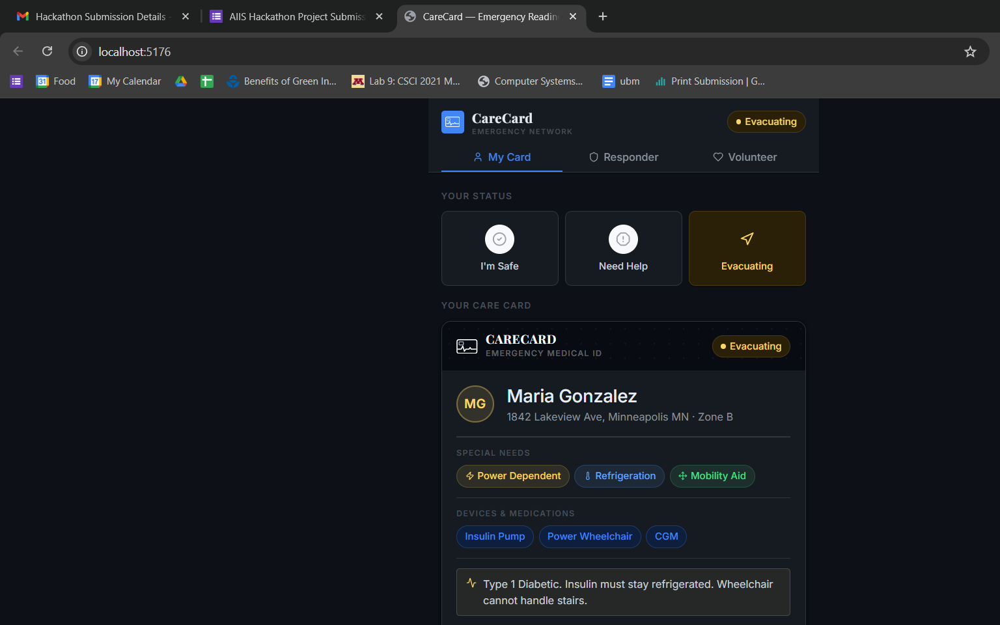
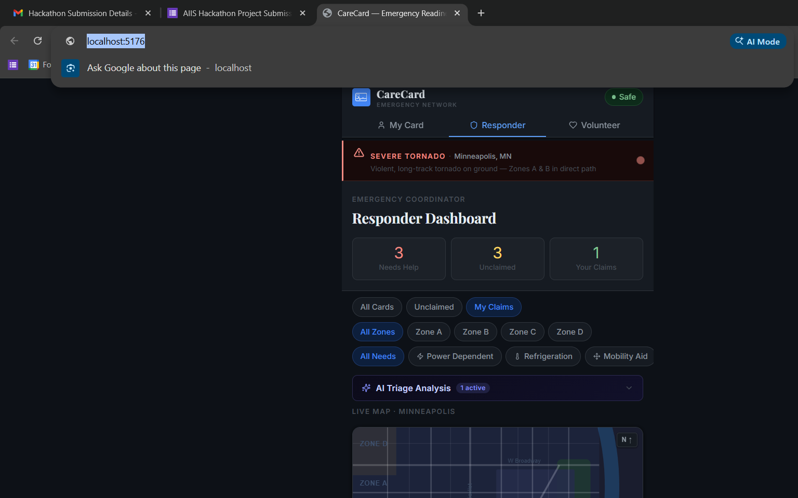

<div align="center">

<br />

```
  ┌─────────────────────────────────┐
  │ ┌──┐                           │
  │ └──┘  ╔╦╗  ╦ ╦╦═╗╔═╗╔═╗       │
  │ ~~~~  ║  ║ ║║╠╦╝╠╣ ╚═╗       │
  │       ╩  ╚═╝╩╚═╚═╝╚═╝       │
  └─────────────────────────────────┘
```

# CareCard

### AI-Powered Emergency Readiness Network

**Connecting people with disabilities to emergency responders — in real time, during disasters.**

[](https://react.dev)
[](https://vitejs.dev)
[](https://anthropic.com)
[](LICENSE)
[](CONTRIBUTING.md)

</div>

---

## The Problem

People with disabilities — those relying on ventilators, insulin pumps, power wheelchairs, and oxygen concentrators — face **disproportionately high risk** during natural disasters. In Hurricane Katrina, over **70% of deaths** were people over 60 or those with disabilities. The core failure: emergency responders had **no way to know who needed help, where they were, or what they needed.**

## What CareCard Does

CareCard gives every person with a disability a **digital emergency ID card** — a living document that tells first responders exactly who they are, what devices they depend on, and what special assistance they need. During a disaster, responders and community volunteers see a real-time board of everyone who needs help, filterable by zone, need type, and urgency.

When seconds matter, Claude AI analyzes every active care card and delivers a **ranked triage order** — so responders act on what matters most, first.

---

## Screenshots

<table>
<tr>
<td width="50%">

**My Care Card**
The user's digital emergency ID — includes status, special needs, life-critical devices, and emergency contacts. Issued by CareCard, readable by any responder.

</td>
<td width="50%">

**Responder Dashboard**
Real-time board of all active care cards, AI triage panel, live Minneapolis map, and one-tap claim/reach workflow.

</td>
</tr>
<tr>
<td>



</td>
<td>



</td>
</tr>
</table>

---

## Core Features

### 🪪 My Care Card
- Build a personal emergency ID with name, address, zone, and phone
- Tag special needs: Power Dependent, Oxygen/Respiratory, Mobility Aid, Vision, Hearing, Cognitive Support, Medical Supervision, Refrigeration
- List critical devices and medications (Ventilator, Insulin Pump, CPAP, etc.)
- Add medical notes for responders — allergies, handling instructions, communication needs
- Set real-time status: **Safe**, **Need Help**, **Evacuating**
- Status broadcasts instantly to the responder/volunteer board

### 🛡️ Responder Dashboard
- Live feed of all community care cards, sorted by urgency
- Stats: needs-help count, unclaimed cards, your active assignments
- Filter by zone (A / B / C / D), need type, and claim status
- Claim cards to take ownership; mark people as reached
- **SEVERE TORNADO** alert banner with active warning details
- Integrated live Minneapolis map with color-coded pins

### 🤝 Volunteer Board
- Same real-time board — designed for community volunteers, not coordinators
- Volunteer to help with a single tap
- Filtered view of unclaimed neighbors who need assistance

### 🗺️ Live Minimap
- Hand-crafted SVG map of Minneapolis with accurate zone overlays
- Color-coded pins: 🔴 Needs Help · 🟡 Evacuating · 🟢 Safe · 🔵 You
- Pulsing animation on critical (needs-help) pins
- Tap any pin → popup with card info and action buttons
- Reflects active filters in real time

### ✦ AI Triage Analysis *(Claude-Powered)*
- Responder-only panel powered by **Claude Sonnet 4.6**
- Sends all active care cards to Claude with full medical context
- Returns a ranked priority list with urgency reasoning and recommended immediate actions
- Considers: life-critical devices, mobility limitations, cognitive needs, status, and medical notes
- See the [AI section](#-how-ai-is-leveraged) for the full breakdown

---

## ✦ How AI Is Leveraged

CareCard uses **Anthropic's Claude Sonnet 4.6** as the core intelligence layer for emergency triage.

### The AI Triage System

During an active disaster, responders can run an AI triage analysis on all currently active care cards. Claude acts as an AI emergency medical coordinator:

**What it receives:**
```json
[
  {
    "id": "c1",
    "name": "David Chen",
    "status": "need-help",
    "needs": ["power", "oxygen", "medical"],
    "devices": ["Ventilator", "Suction Machine"],
    "medicalNotes": "ALS. Ventilator-dependent. Power outage is immediately life-threatening."
  },
  ...
]
```

**What Claude returns:**
```json
[
  {
    "id": "c1",
    "name": "David Chen",
    "priority": 1,
    "urgency_reason": "Ventilator-dependent ALS patient — power loss is an immediate, life-threatening emergency.",
    "action": "Dispatch power unit or evacuate to generator-equipped shelter within 30 minutes."
  },
  {
    "id": "c2",
    "name": "Ruth Patel",
    "priority": 2,
    "urgency_reason": "Dementia + heart failure, lives alone, oxygen concentrator — cannot self-evacuate.",
    "action": "Send escort team; coordinate cardiac-aware transport to medical shelter."
  }
]
```

**Why this matters:**  
A dispatcher managing 7+ active cards in a tornado scenario has seconds to decide who gets help first. Claude reads every medical note, weighs device criticality, accounts for cognitive and mobility barriers, and outputs a medically-grounded priority ranking — faster than any manual triage.

### Architecture

The AI layer is secured entirely server-side:

```
Browser → POST /api/anthropic/v1/messages
              ↓ (Vite dev proxy)
         API key injected server-side
              ↓
         Anthropic Claude API
              ↓
         Structured JSON triage results
              ↓
         Rendered in responder dashboard
```

The API key **never touches the browser bundle**. The Vite dev proxy rewrites `/api/anthropic/*` to `https://api.anthropic.com/*` and injects `x-api-key` from the server environment.

---

## Tech Stack

| Layer | Technology |
|-------|-----------|
| Frontend | React 18 + Vite 5 |
| AI | Claude Sonnet 4.6 (Anthropic) |
| Icons | Lucide React |
| Map | Hand-crafted SVG (no external map library) |
| Fonts | Playfair Display · Inter (Google Fonts) |
| State | React Context (no Redux) |
| Styling | Custom CSS, CSS Variables, dark mode |
| API Proxy | Vite dev server proxy (API key server-side only) |

---

## Getting Started

### Prerequisites
- Node.js 18+
- An [Anthropic API key](https://console.anthropic.com/) (for AI triage)

### Installation

```bash
# Clone the repo
git clone https://github.com/90Ismail/CareCard.git
cd CareCard

# Install dependencies
npm install

# Set up environment variables
cp .env.example .env
# Add your Anthropic API key to .env
```

### Environment Variables

```bash
# .env
ANTHROPIC_API_KEY=sk-ant-...
```

> The API key is only used by the Vite dev server proxy — it is **never bundled into the client.**

### Run

```bash
npm run dev
# → http://localhost:5173
```

### Build

```bash
npm run build
npm run preview
```

---

## App Structure

```
src/
├── components/
│   ├── AITriage.jsx        # Claude-powered triage analysis panel
│   ├── CareCardBrand.jsx   # SVG logo, alert banner, person avatar
│   ├── MapView.jsx         # Minneapolis SVG minimap with live pins
│   └── ModeBar.jsx         # Navigation header with status pill
├── context/
│   └── AppContext.jsx      # Shared state (cards, status, claims)
├── data/
│   └── mockData.js         # Demo scenario: Minneapolis tornado, 7 residents
├── pages/
│   ├── Board.jsx           # Responder + Volunteer dashboard
│   └── MyCard.jsx          # Personal care card builder
└── index.css               # Design system (dark, CSS variables)
```

---

## Demo Scenario

The app ships with a pre-loaded **Minneapolis severe tornado** scenario:

| Person | Zone | Status | Critical Need |
|--------|------|--------|--------------|
| David Chen | A | 🔴 Needs Help | ALS — ventilator-dependent |
| Ruth Patel | B | 🔴 Needs Help | Dementia + heart failure, lives alone |
| Thomas Mbeki | A | 🔴 Needs Help | Blind + PTSD, needs verbal-only contact |
| Eleanor Vasquez | B | 🟡 Evacuating | End-stage renal disease, dialysis machine |
| James Okoye | C | 🟢 Safe | Quadriplegia — accessible route confirmed |
| Linda Johansson | C | 🟢 Safe | Insulin-dependent, fridge access needed |
| Ahmed Hassan | D | 🟢 Safe | Cerebral palsy, AAC device — claimed & reached |

Switch to **Responder** mode → open **AI Triage Analysis** → click **Run Triage** to see Claude rank and explain each case.

---

## Roadmap

- [ ] Real-time sync (WebSockets / Supabase)
- [ ] Push notifications for responders when new cards appear
- [ ] QR code generation for physical CareCard printout
- [ ] Offline-first PWA with service worker
- [ ] Real map integration (Mapbox) with routing
- [ ] Multi-language support
- [ ] SMS integration for people without smartphones

---

## Contributing

Contributions are welcome. Please open an issue before submitting a PR for large changes.

```bash
# Fork, clone, install
git checkout -b feature/your-feature
npm run dev
# Make changes, test, submit PR
```

---

## License

MIT © [CareCard Contributors](https://github.com/90Ismail/CareCard)

---

<div align="center">

Built with care for the disability community.

*"In every emergency, the most vulnerable deserve to be found first."*

</div>
